# Laporan Modul 1: Review Dasar Pemrograman Java
**Mata Kuliah:** Praktikum Design Pattern  
**Nama:** Alif Riski Adriansyah
**NIM:** 2024573010110
**Kelas:** TI 2A

---

## Tujuan
1. Memahami sintaks dasar pemrograman Java.
2. Mampu membuat program sederhana menggunakan Java.
3. Memahami konsep variabel, tipe data, operator, percabangan, dan perulangan.
4. Mampu menyelesaikan masalah sederhana dengan menerapkan konsep dasar pemrograman Java.
=
## Outline Model
* Pengenalan Java dan Lingkungan Pengembangan
* Variabel dan Tipe Data
* Operator dan Ekspresi
* Percabangan (If-Else dan Switch-Case)
* Perulangan (For, While, Do-While)
* Practice Problem dan Solusi

---

## 1. Pengenalan Java dan Lingkungan Pengembangan
&emsp;&emsp;Java adalah bahasa pemrograman berorientasi objek yang populer dan banyak digunakan untuk pengembangan aplikasi desktop, web, dan mobile. Java menggunakan sintaks yang mirip dengan C++ tetapi dirancang untuk lebih mudah dipahami dan digunakan.

Untuk memulai pemrograman Java, Anda perlu:
1. JDK (Java Development Kit): Berisi compiler dan tools untuk mengembangkan program Java.
2. IDE (Integrated Development Environment): Seperti IntelliJ IDEA, Eclipse, atau NetBeans untuk menulis dan menjalankan kode.

### 1.1 Langkah Praktikum
1. Pastikan JDK dan Intellij IDE Community Edition sudah terinstal. Jika belum, kunjungi url berikut untuk mengunduh JDK Amazon Correto dan Intellij
2. Buka IDE dan buat sebuah project baru dengan ketentuan seperti berikut:

> * Name: ti_design_pattern
> * Location: disesuaikan
> * Build system: Intellij
> * JDK: Amazon Correto
> * Hilangkan centang pada bagian `add sample code`

Contoh:
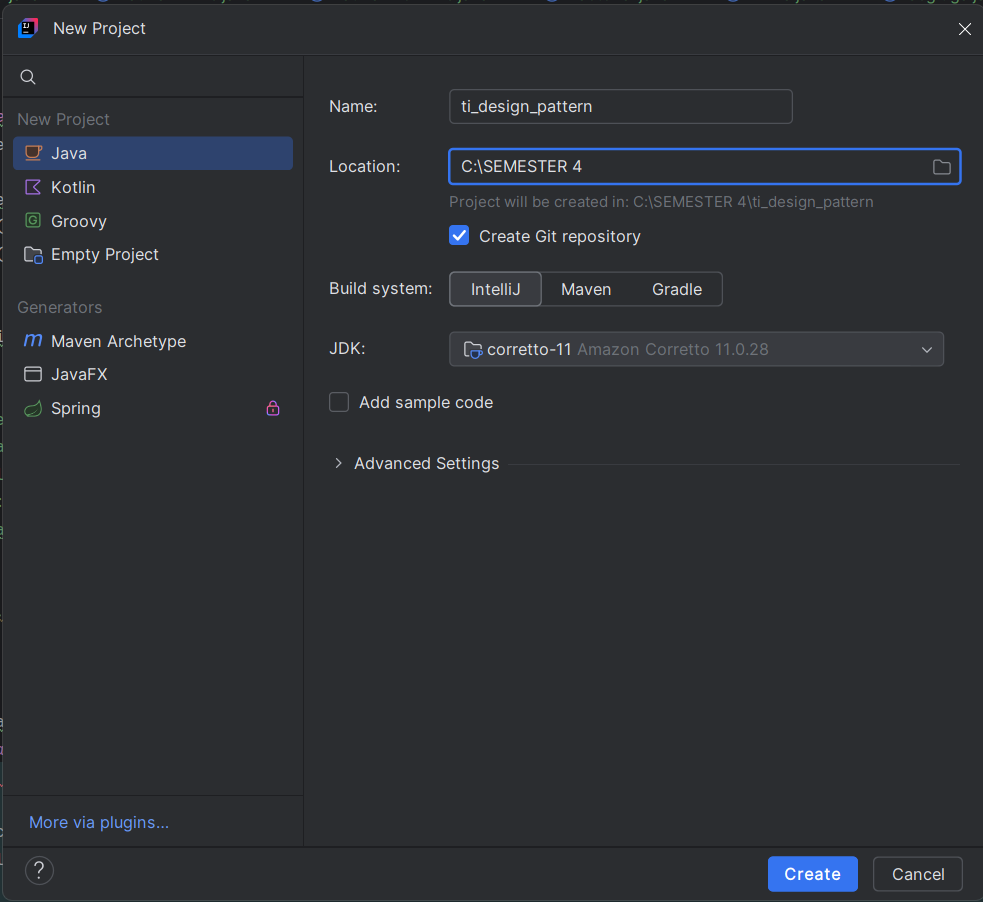

3. Buat sebuah package baru di dalam folder `src` dengan cara klik kanan pada folder `src` kemudian pilih `New -> Package`. Beri nama `modul_1`.
4. Buat Sebuah class didalam package `modul_1` dengan cara klik kanan dan pilih `New -> Java Class`. Beri nama `HelloWorld`
5. Isikan kode dibawah ini.
```declarative
package modul_1;

public class HelloWorld {
    public static void main(String[] args) {
        System.out.println("Hello, World!");
    }
}
```

6. Jalankan program.

### 1.2 Hasil
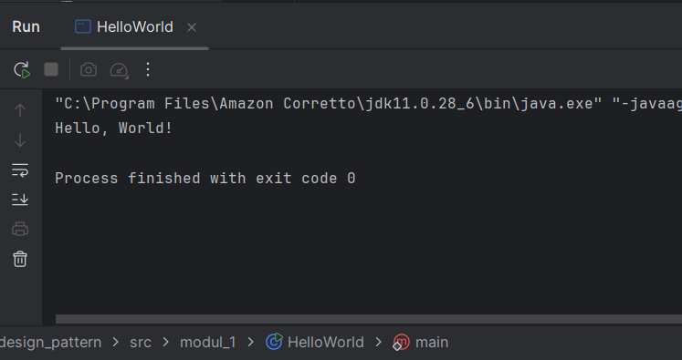

## 2. Variabel dan Tipe Data
Variabel digunakan untuk menyimpan data dalam program. Setiap variabel memiliki tipe data yang menentukan jenis nilai yang dapat disimpan. Tipe data dasar di Java:

1. int: Bilangan bulat (contoh: 10, -5)
2. double: Bilangan desimal (contoh: 3.14, -0.5)
3. boolean: Nilai true atau false
4. char: Karakter tunggal (contoh: 'A', '1')
5. String: Teks (contoh: "Hello")

### 2.1 Langkah Praktikum
1. Buat sebuah class baru di dalam package `modul_1` dan beri nama `Variable`
2. Tuliskan kode berikut:
```declarative
package modul_1;

public class Variable {
    public static void main(String[] args) {
        int umur = 20;
        double tinggi = 1.75;
        boolean isMahasiswa = true;
        char JenisKelamin = 'L';
        String nama = "Budi";

        System.out.println("Nama: " + nama);
        System.out.println("Umur: "  + umur);
        System.out.println("Tinggi: "  + tinggi);
        System.out.println("Mahasiswa: "  + isMahasiswa);
        System.out.println("JenisKelamin: " + JenisKelamin);
    }
}
```
3. Jalankan program nya untuk melihat hasil.

### 2.2 Latihan
&emsp;&emsp;Buatlah program untuk menampilkan data diri anda yang lengkap dengan attribut seperti berikut:
```
Nama Lengkap, Tempat Lahir, Tanggal Lahir, Golongan Darah, Umur, Tinggi Badan, Jenis Kelamin, Agama, Pekerjaan.
```
Gunakan tipe data yang tepat untuk setiap variabel. Silahkan cari referensi jika mengalami kendala.

> Untuk membuat latihan, buatkan sebuah package baru di dalam package `modul_1` dan beri nama `latihan`. Kemudian, buat sebuah class dengan nama disesuaikan dengan tugas. Kemudian tuliskan solusi anda di dalam class tersebut.

### 2.3 Hasil
Hasil Praktikum :
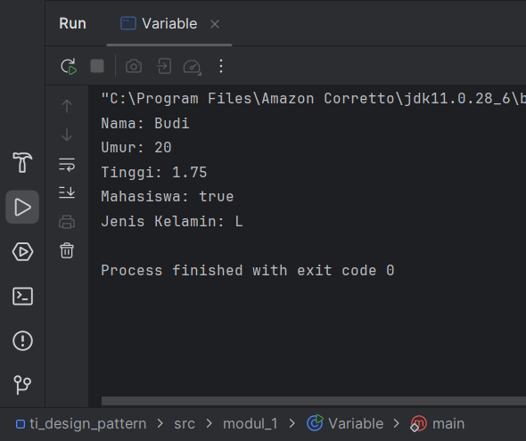

Kode Latihan :
```declarative
package modul_1.latihan;

public class LatihanVariabel {
public static void main(String[] args) {
// Deklarasi variabel sesuai urutan
String nama = "Alif Riski Adriansyah";
String tempatLahir = "Lhokseumawe";
String tanggalLahir = "21 Juli 2005";
String golonganDarah = "O";
int umur = 20;
double tinggiBadan = 185.5;
char jenisKelamin = 'L';
String agama = "Islam";
String pekerjaan = "Mahasiswa";

// Menampilkan data ke layar
System.out.println("Nama Lengkap   : " + nama);
System.out.println("Tempat Lahir   : " + tempatLahir);
System.out.println("Tanggal Lahir  : " + tanggalLahir);
System.out.println("Golongan Darah : " + golonganDarah);
System.out.println("Umur           : " + umur);
System.out.println("Tinggi Badan   : " + tinggiBadan);
System.out.println("Jenis Kelamin  : " + jenisKelamin);
System.out.println("Agama          : " + agama);
System.out.println("Pekerjaan      : " + pekerjaan);
}
}
```
Hasil Latihan :
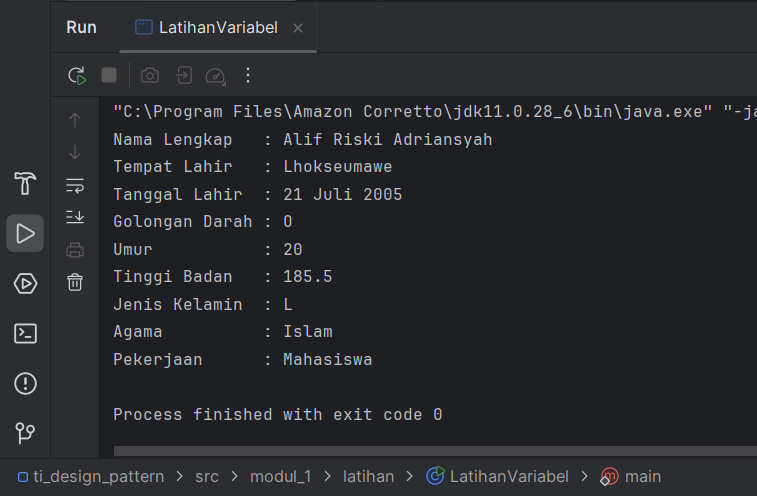

## 3. Operator dan Expressi
&emsp;&emsp;Operator digunakan untuk melakukan operasi pada variabel dan nilai. Jenis operator:

1. Aritmatika: `+, -, *, /, %`
2. Perbandingan: `==, !=, >, <, >=, <=`
3. Logika: `&& (AND), || (OR), ! (NOT)`

### 3.1 Langkah Praktikum
1. Buat sebuah class baru di dalam package `modul_1` dan beri nama `Operator`
2. Tuliskan kode berikut:
```declarative
package modul_1;

public class Operator {
    public static void main(String[] args) {
        int a = 10;
        int b = 5;

        System.out.println("a + b = " + (a + b));
        System.out.println("a > b ? " + (a > b));
        System.out.println("a == b ? " + (a == b));
    }
}
```
3. Jalankan program nya untuk melihat hasil.

### 3.2 Latihan
Buat program untuk menghitung luas persegi panjang (panjang * lebar)

### 3.3 Hasil
Hasil Praktikum :
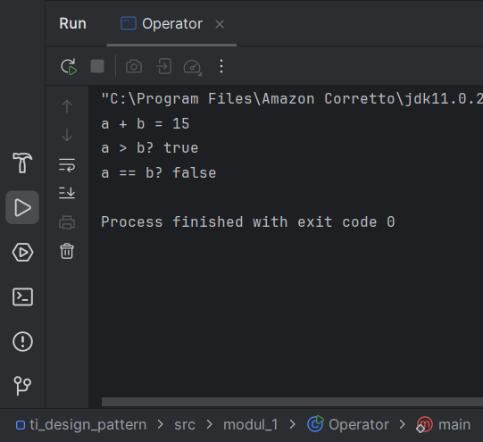

Hasil Latihan :
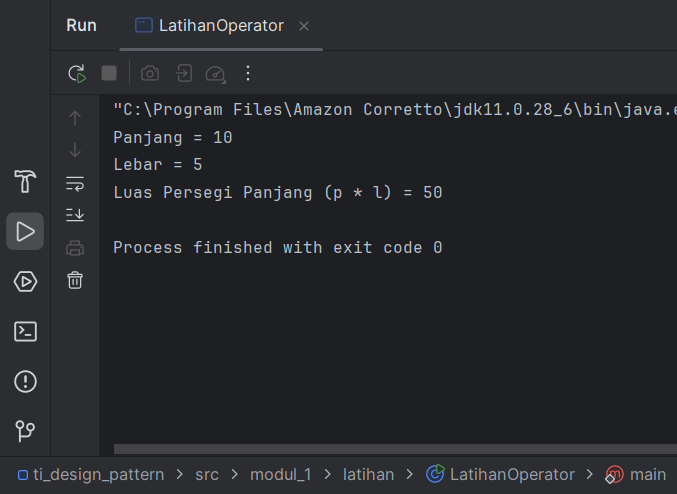

## 4. Percabangan (If-Else dan Switch-Case)
Percabangan digunakan untuk mengambil keputusan berdasarkan kondisi.

If-Else:
```declarative
if (kondisi) {
    // Blok kode jika kondisi true
} else {
    // Blok kode jika kondisi false
}
```

Switch-Case:
```declarative
switch (variabel) {
    case nilai1:
        // Blok kode jika variabel == nilai1
        break;
    case nilai2:
        // Blok kode jika variabel == nilai2
        break;
    default:
        // Blok kode jika tidak ada case yang sesuai
}
```

### 4.1 Langkah Praktikum
1. Buat sebuah class baru di dalam package `modul_1` dan beri nama `Percabangan`
2. Tuliskan kode berikut:
```declarative
package modul_1;

public class Percabangan {
    public static void main(String[] args) {
        int nilai = 85;

        if (nilai >= 75) {
            System.out.println("Anda lulus!");
        } else {
            System.out.println("Anda tidak lulus.");
        }
    }
}
```
3. Jalankan program nya untuk melihat hasil.

### 4.2 Latihan
Buat program untuk menentukan apakah suatu bilangan genap atau ganjil.

### 4.3 Hasil
Hasil Praktikum :
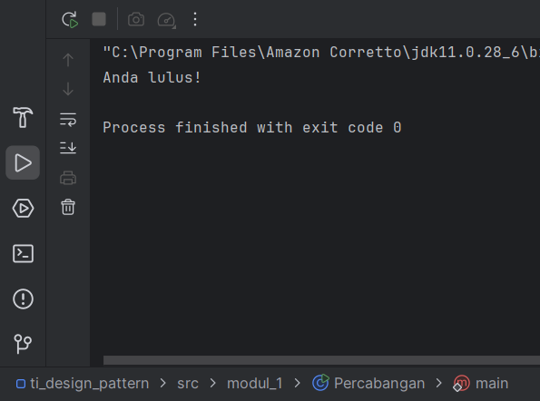

Kode Latihan :
```declarative
package modul_1.latihan;

public class LatihanPercabangan {
    public static void main(String[] args) {
        int angka = 10; // Ganti angka ini untuk mencoba

        if (angka % 2 == 0) {
            System.out.println(angka + " adalah bilangan genap.");
        } else {
            System.out.println(angka + " adalah bilangan ganjil.");
        }
    }
}
```
Hasil Latihan :
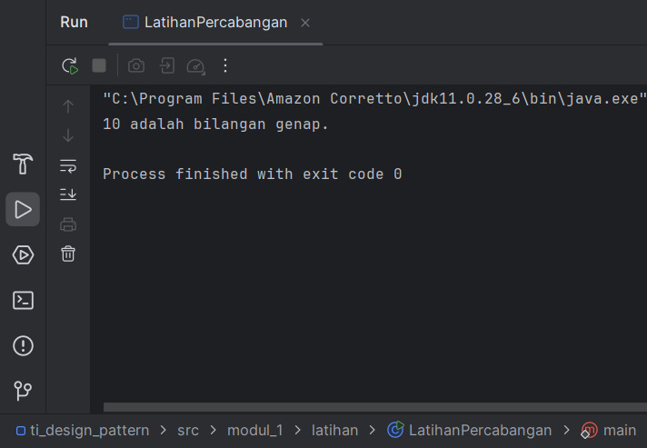

## 5. Perulangan (For, While, Do-While)
Perulangan digunakan untuk mengulang blok kode.

For:
```declarative
for (inisialisasi; kondisi; update) {
// Blok kode yang diulang
}
```

While:
```declarative
while (kondisi) {
// Blok kode yang diulang
}
```

Do-While:
```declarative
do {
// Blok kode yang diulang
} while (kondisi);
```

### 5.1 Langkah Praktikum
1. Buat sebuah class baru di dalam package `modul_1` dan beri nama `Perulangan`
2. Tuliskan kode berikut:
```declarative
package modul_1;

public class Perulangan {
    public static void main(String[] args) {
        for (int i = 1; i <= 5; i++) {
            System.out.println("Iterasi ke-" + i);
        }
    }
}
```
3. Jalankan program nya untuk melihat hasil.

### 5.2 Latihan
Buat program untuk mencetak bilangan ganjil dari 1 hingga 20. Buat 3 program dengan menggunakan for, while, do-while.

### 5.3 Hasil Praktikum
Hasil Praktikum :
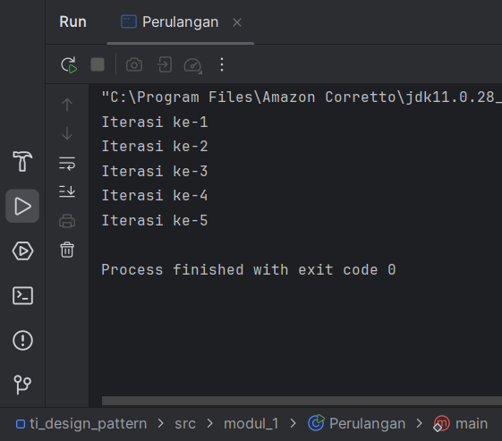

Kode Latihan :
```declarative
package modul_1.latihan;

public class LatihanFor {
    public static void main(String[] args) {
        for (int i = 1; i <= 20; i += 2) {
            System.out.println("Angka: " + i);
        }
    }
}
```

```declarative
package modul_1.latihan;

public class LatihanWhile {
    public static void main(String[] args) {
        int i = 1;
        while (i <= 20) {
            System.out.println("Angka: " + i);
            i += 2;
        }
    }
}

```

```declarative
package modul_1.latihan;

public class LatihanDoWhile {
    public static void main(String[] args) {
        int i = 1;
        do {
            System.out.println("Angka: " + i);
            i += 2;
        } while (i <= 20);
    }
}

```

Hasil Latihan :
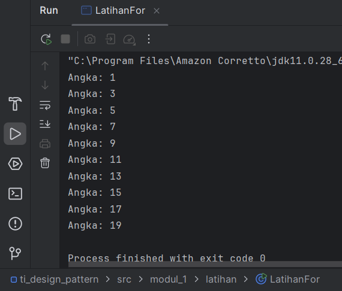


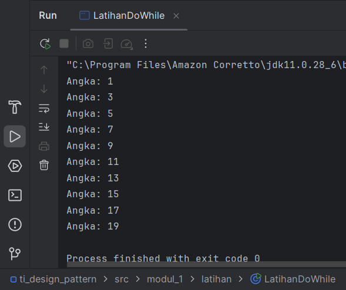

## 6. Practice Problem dan Solusinya
Practice Problem:
1. Buat program untuk menghitung faktorial dari suatu bilangan.
2. Buat program untuk mengecek apakah suatu bilangan adalah bilangan prima.
3. Buat program untuk mencetak pola segitiga menggunakan *.

### 6.1 Solusi
1. Buat sebuah class baru di dalam package `modul_1` dan beri nama `Factorial` dan isikan kode berikut. Kemudian jalankan untuk melihat hasilnya.
```declarative
package modul_1;

public class Faktorial {
    public static void main(String[] args) {
        int n = 5;
        int hasil = 1;
        for (int i = 1; i <= n; i++) {
            hasil *= i;
        }
        System.out.println("Faktorial dari " + n + " adalah " + hasil);
    }
}
```
2. Buat sebuah class baru di dalam package `modul_1` dan beri nama `Prima` dan isikan kode berikut. Kemudian jalankan untuk melihat hasilnya.
```declarative
package modul_1;

public class Prima {
    public static void main(String[] args) {
        int n = 7;
        boolean isPrima = true;
        for (int i = 2; i <= n/2; i++) {
            if (n % i == 0) {
                isPrima = false;
                break;
            }
        }
        System.out.println(n + (isPrima ? " adalah bilangan prima." : " bukan bilangan prima."));
    }
}
```
3. Buat sebuah class baru di dalam package `modul_1` dan beri nama `Segitiga` dan isikan kode berikut. Kemudian jalankan untuk melihat hasilnya.
```declarative
package modul_1;

public class Segitiga {
    public static void main(String[] args) {
        int tinggi = 5;
        for (int i = 1; i <= tinggi; i++) {
            for (int j = 1; j <= i; j++) {
                System.out.print("* ");
            }
            System.out.println();
        }
    }
}
```

### Hasil
Hasil Praktikum :
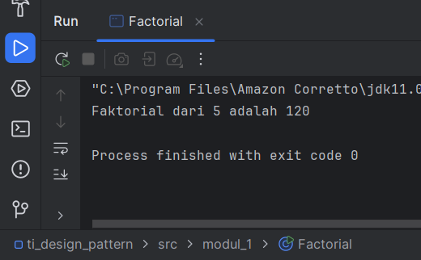

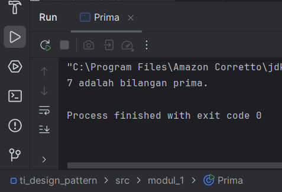

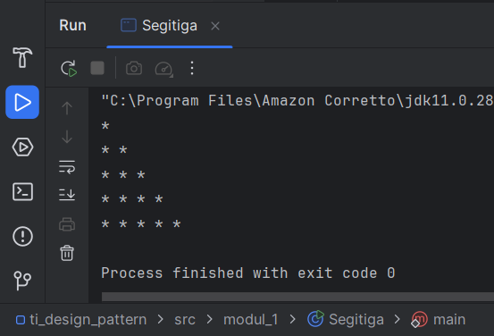

## Penutup
&emsp;&emsp;Dengan menyelesaikan modul ini, Anda telah mempelajari dasar-dasar pemrograman Java dan mampu membuat program sederhana. Lanjutkan dengan mempelajari konsep pemrograman yang lebih kompleks seperti array, method, dan pemrograman berorientasi objek.